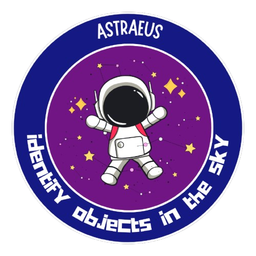

# Astraeus
OUR PROJECT 

  

Astraeus is a machine learning project designed to identify different celestial objects from camera images. The goal is to help automate astronomical image classification so that researchers and space organizations can more easily analyze and interpret large sets of sky data. As astronomical missions continue to expand, the volume of available images has increased faster than manual labeling can keep up with. This project shows how machine learning can support large scale scientific discovery by improving the efficiency and accuracy of identifying planets, stars, asteroids, and black holes.

Astraeus connects directly to concepts from class. We use regularization to prevent overfitting, convolutional neural networks for multiclass image classification, and the Adam optimizer as an adaptive form of gradient descent. These ideas come together in a practical application that shows how machine learning methods can handle real world datasets.

The project uses a smaller, curated version of the SpaceNet Comprehensive Astronomical Dataset. Because the full dataset is extremely large, we selected about forty images per class and stored them locally in a structured directory. Our final four classes are planets, stars, black holes, and asteroids. The images vary in brightness, quality, and detail, which makes the dataset a realistic challenge for classification tasks. Each image is resized to 128 by 128 pixels, converted to an array, and normalized so that pixel values range between zero and one.

The most important change we made during development was switching to transfer learning. Instead of training a convolutional neural network from scratch which would require thousands of images we used a pretrained model called MobileNetV2. MobileNetV2 was trained by Google on more than one million images. Because of that, it has already learned to identify many low level and mid level visual patterns such as edges, curves, shapes, and textures. These early features transfer well to almost any image based task, including astronomy.

We used MobileNetV2 as our feature extractor. We removed its original final layer which predicts one thousand ImageNet classes and replaced it with our own dense layer that outputs predictions for our four celestial categories. All earlier layers were kept frozen so that we would not overwrite the strong visual representations the model had already learned. We trained only our new final layer. This approach allowed us to achieve strong performance even though we had a relatively small dataset.

The model was trained using categorical cross entropy as the loss function, with optimization done through Adam. Throughout training we used Matplotlib to track and visualize accuracy, loss, and convergence. These plots helped us confirm that the model was learning consistently without strong signs of underfitting or overfitting.

Astraeus also includes a working frontend. We have also connected our trained MobileNetV2 model to the interface. Now that this integration is complete, users will be able to upload their own images through the frontend and receive predictions directly from the model. This will turn Astraeus into an interactive tool that can support both learning and research.

CITATIONS:
In 2024, Mohammed Talha Alam, Raza Imam, Mohsen Guizani, and Fakhri Karray released a paper titled FLARE up your data: Diffusion-based Augmentation Method in Astronomical Imaging. It was published on arXiv in the computer vision category with the identifier 2405.13267.} 
Link to Dataset: https://www.kaggle.com/datasets/razaimam45/spacenet-an-optimally-distributed-astronomy-data 
